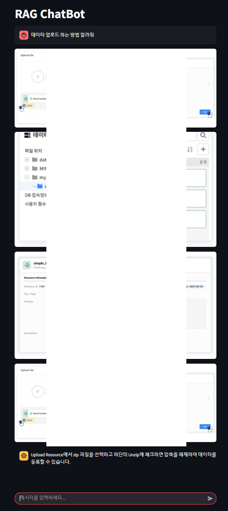
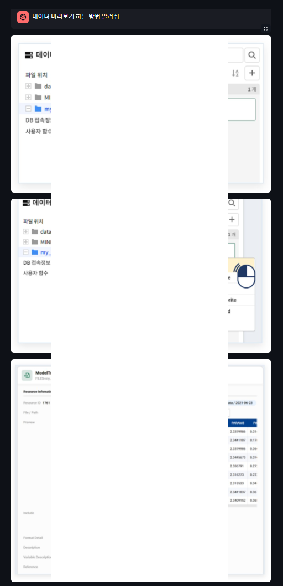
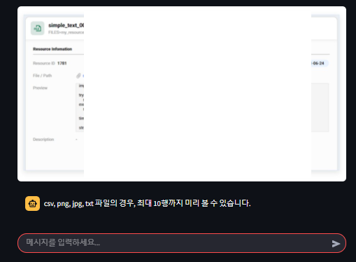

# RAG-ChatBot

## 프로젝트 개요
- RAG(Reformulated Attention Generator) 모델을 활용한 ChatBot
- PDF 문서를 읽고 질문에 답변하는 ChatBot
- 현재는 사내 프로그램 설명서에 대한 답변을 출력하도록 구현
- 설명 이미지도 중요한 문서이므로 질문과 관련된 이미지도 출력
- Fast API로 언어 모델 API 개발
- Streamlit으로 웹 페이지 개발



## 기술 스텍
- Python                       3.12.3
- fastapi                      0.115.8
- streamlit                    1.42.1
- langchain                    0.3.18
- langchain-community          0.3.17
- langchain-core               0.3.34
- langchain-google-genai       2.0.9
- langchain-ollama             0.2.3
- langchain-text-splitters     0.3.6
- SQLAlchemy                   2.0.37

## 설치 및 실행 방법
### 설치 방법 
```
git clone https://github.com/taejongK/RAG-LAB.git
```

### 환경 설정
```
pip install -r requirements.txt
```

### 실행 환경
- Windows 11 WSL2

### 실행 방법
0. 실행전 api와 pdf 파일 준비
   - root directory에 `.env` 파일 생성
   - 아래 내용 추가
   ```
   HUGGINGFACEHUB_API_TOKEN = "API_TOKEN"
   GOOGLE_API_KEY = "API_TOKEN"
   ```

1. pdf vectorDB 저장
   - `root directory`에 `database` 폴더 생성
   - vectorDB에 저장할 PDF 문서를 `database`폴더에 저장
   - `project root directory`에서 다음 명령어 실행 
   ```
   python pdf_to_vector.py
   ```

2. chatbot 실행방법
   - router 실행
   ```
   cd app
   python main.py
   ```

   다른 터미널 창에서 아래 명령어를 실행합니다.
   - client page 실행
   ```
   cd app
   streamlit run app.py --server.fileWatcherType none  
   ```
   - Streamlit이 파일을 감시하면서 발생하는 문제이므로, 이 기능을 비활성화하면 해결될 가능성이 큼


## API 문서
- router 실행 후 아래 주소로 접속
http://127.0.0.1:8000/docs

### Request Create Chatbot
- /chatbot/create/{uuid}
- uuid: ChatBot 인스턴스 별로 부여되는 고유한 값 Session 별로 부여되어 Session ID로 사용
- method: POST

### Request Response Chatbot
- /chatbot/{uuid}
  ```
  {
    "uuid": "string",
    "query": "string"
  }
  ```
- query: 사용자의 질문
- method: POST

### Response Delete Chatbot
- /chatbot/delete/{uuid}
- uuid(Session ID)를 보내면 존재하는 ChatBot을 삭제합니다.
- method: DELETE
- 프로토 타입에서는 사용하지 않고 있습니다.
  ```
  {
    "uuid": "string",
    "query": "string",
    "answer": "string"
  }
  ```
## 사용방법
### 스크린샷
  
  
  

### 주요 기능 설명
1. 질문에 대한 답변
   - LLM을 사용해 사용자의 질문에 답변

2. 이미지 출력
   - 질문과 관련된 이미지 출력
   - 원본 PDF를 markdown 형식으로 변환하여 해당 이미지를 이미지 경로로 변환
   - 문서 내용과 함께 `image_path`를 `meta data`로 저장
   - 질문과 관련된 내용이 검색 될 때, `meta data`에 저장된 이미지를 출력

3. 대화 내용 저장
   - 사용자의 질문과 답변을 저장하여 추후 분석에 사용
   - `ChatHistory` 테이블에 저장

## 구조 및 아키텍쳐
```
RAG-LAB
├── app                  # 메인 애플리케이션 디렉토리
│   ├── chatbot          # chatbot 기능 모듈
│   ├── routes           # 라우트 핸들러
│   ├── repository       # 데이터베이스 모델 (SQLAlchemy)
│   ├── services         # 서비스 로직 (ex: 데이터 처리)
│   ├── main.py          # FastAPI 엔트리 포인트
│   └── clietn.py        # Streamlit 엔트리 포인트
├── requirements.txt     # Python 패키지 의존성 목록
└── README.md            # 프로젝트 문서
```
### Router(Endpoint)
- `GET /`: 웹 페이지
- `/chatbot/create/{uuid}`: 챗봇 생성
- `/chatbot/response/{uuid}`: 챗봇 대화
- `/chatbot/delete/{uuid}`: 챗봇 삭제

### Service
- create_chatbot: 챗봇 생성
- response_chatbot: 질문을 받으면 답을 주는 챗봇
- delete_chatbot: 챗봇 삭제(미구현)

### Repository
- ChatHistory
  - id: Primary Key
  - uuid: ChatBot 인스턴스 별로 부여
  - question: 사용자의 질문
  - answer: LLM의 답변
  - question_time: 질문 시간
  - answer_time: 답변 시간
- ChatbotRepository
  - save_conversation: User와 LLM 의 대화 내용을 저장
  - get_conversation: User와 LLM 의 대화 내용을 가져옴

### Chatbot
- prompt
  - chat_history: 사용자와 챗봇의 대화 내용 입력
  - question: 사용자의 질문 입력
  - context: 사용자의 질문과 관련된 자료 입력
- llm: ChatGoogleGenerativeAI(model="gemini-1.5-pro-latest") 사용
- store: session id 별로 대화 내용 저장


## 향후 개발 계획
__v0.2.0: 2025.03.08 까지__
- [ ] ChatBot 삭제 기능 구현
- [x] PDF 변환 및 분할 모듈 구현
- [ ] chatbot 모듈 코드 리팩토링
- [x] 이미지가 필요 없는 경우 이미지를 출력하지 않도록 수정