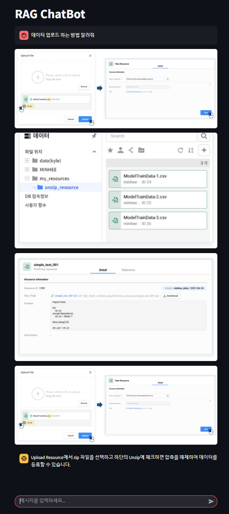
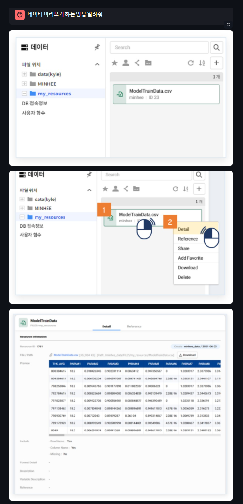
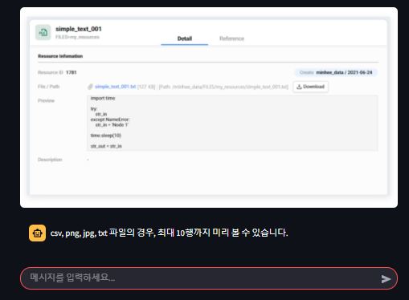

# RAG-ChatBot

## 프로젝트 개요
- RAG(Reformulated Attention Generator) 모델을 활용한 ChatBot
- PDF 문서를 읽고 질문에 답변하는 ChatBot
- 현재는 사내 프로그램 설명서에 대한 답변을 출력하도록 구현
- 설명 이미지도 중요한 문서이므로 질문과 관련된 이미지도 출력
- Fast API로 언어 모델 API 개발
- Streamlit으로 웹 페이지 개발



## 기술 스텍
- Python                       3.12.3
- fastapi                      0.115.8
- streamlit                    1.42.1
- langchain                    0.3.18
- langchain-community          0.3.17
- langchain-core               0.3.34
- langchain-google-genai       2.0.9
- langchain-ollama             0.2.3
- langchain-text-splitters     0.3.6
- SQLAlchemy                   2.0.37

## 설치 및 실행 방법
### 설치 방법 
```
git clone https://github.com/taejongK/RAG-LAB.git
```

### 환경 설정
```
pip install -r requirements.txt
```

### 실행 방법
- router 실행
```
cd app
python main.py
```

다른 터미널 창에서 아래 명령어를 실행합니다.
- client page 실행
```
cd app
streamlit run app.py --server.fileWatcherType none  
```
- Streamlit이 파일을 감시하면서 발생하는 문제이므로, 이 기능을 비활성화하면 해결될 가능성이 큼


## API 문서
- router 실행 후 아래 주소로 접속
http://127.0.0.1:8000/docs

### Request Create Chatbot
- /chatbot/create/{uuid}
- uuid: ChatBot 인스턴스 별로 부여되는 고유한 값 Session 별로 부여되어 Session ID로 사용
- method: POST

### Request Response Chatbot
- /chatbot/{uuid}
```
{
  "uuid": "string",
  "query": "string"
}
```
- query: 사용자의 질문
- method: POST

### Response Delete Chatbot
- /chatbot/delete/{uuid}
- uuid(Session ID)를 보내면 존재하는 ChatBot을 삭제합니다.
- method: DELETE
- 프로토 타입에서는 사용하지 않고 있습니다.
```
{
  "uuid": "string",
  "query": "string",
  "answer": "string"
}
```
## 사용방법
### 스크린샷




### 주요 기능 설명
1. 질문에 대한 답변
- LLM을 사용해 사용자의 질문에 답변

2. 이미지 출력
- 질문과 관련된 이미지 출력
- 원본 PDF를 markdown 형식으로 변환하여 해당 이미지를 이미지 경로로 변환
- 문서 내용과 함께 `image_path`를 `meta data`로 저장
- 질문과 관련된 내용이 검색 될 때, `meta data`에 저장된 이미지를 출력

3. 대화 내용 저장
- 사용자의 질문과 답변을 저장하여 추후 분석에 사용
- `ChatHistory` 테이블에 저장

## 구조 및 아키텍쳐
```
RAG-LAB
├── app                  # 메인 애플리케이션 디렉토리
│   ├── chatbot          # chatbot 기능 모듈
│   ├── routes           # 라우트 핸들러
│   ├── repository       # 데이터베이스 모델 (SQLAlchemy)
│   ├── services         # 서비스 로직 (ex: 데이터 처리)
│   ├── main.py          # FastAPI 엔트리 포인트
│   └── clietn.py        # Streamlit 엔트리 포인트
├── requirements.txt     # Python 패키지 의존성 목록
└── README.md            # 프로젝트 문서
```
### Router(Endpoint)
- `GET /`: 웹 페이지
- `/chatbot/create/{uuid}`: 챗봇 생성
- `/chatbot/response/{uuid}`: 챗봇 대화
- `/chatbot/delete/{uuid}`: 챗봇 삭제

### Service
- create_chatbot: 챗봇 생성
- response_chatbot: 질문을 받으면 답을 주는 챗봇
- delete_chatbot: 챗봇 삭제(미구현)

### Repository
- ChatHistory
    - id: Primary Key
    - uuid: ChatBot 인스턴스 별로 부여
    - question: 사용자의 질문
    - answer: LLM의 답변
    - question_time: 질문 시간
    - answer_time: 답변 시간

### Chatbot


## 향후 개발 계획
- v0.1.0: 2025.02.26
    - ~~ChatBot 기능 구현~~
    - ~~이미지 출력 기능 구현~~
    - ~~대화 내용 저장 기능 구현~~ 
- v0.2.0: 2025.03.08 까지
    - ChatBot 삭제 기능 구현
    - 의존성 주입 코드 작성
    - PDF 변환 및 분할 모듈 구현
    - 이미지 데이터 완결성 개선
    - chatbot 모듈 코드 리팩토링


## 1. 프로젝트 소개
- RAG(Reformulated Attention Generator) 모델을 활용한 ChatBot입니다.
- fast-api로 언어 모델 api 개발
- streamlit으로 웹 페이지 개발

## 2. 프로젝트 구조

### 2.1. Router(Endpoint)
- `GET /`: 웹 페이지
- `/chatbot/create/{uuid}`: 챗봇 생성
- `/chatbot/response/{uuid}`: 챗봇 대화
- `/chatbot/delete/{uuid}`: 챗봇 삭제

### 2.2. Service
- create_chatbot: 챗봇 생성
- response_chatbot: 질문을 받으면 답을 주는 챗봇
- delete_chatbot: 챗봇 삭제(미구현)

### 2.3. Repository
- ChatHistory
    - id: Primary Key
    - uuid: ChatBot 인스턴스 별로 부여
    - question: 사용자의 질문
    - answer: LLM의 답변
    - question_time: 질문 시간
    - answer_time: 답변 시간


## 3. Model
### 3.1 Enbedding
- hugging face -> "jhgan/ko-sroberta-multitask"

### 3.2 LLM
- google gemini 1.5 pro 

### 3.3 Retriever
- 미구현